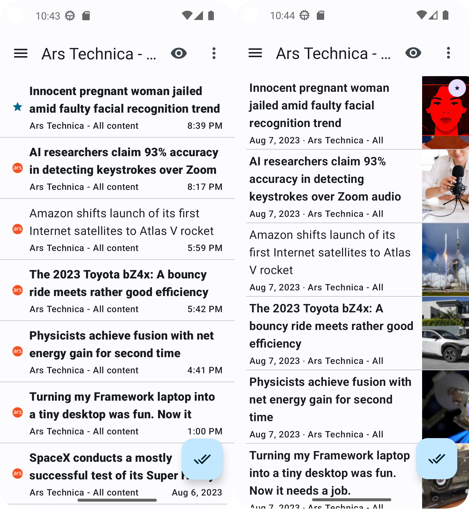

End of summer vacation is looming which means it's getting time to release everything I've been working on during the summer.

Because of several user-facing changes this version will be `2.5.0`.

To highlight said changes I thought I'd actually write about them for once. First up is the most obvious change of all: article styles.

First a couple of common points:

*The New indicator is **GONE**. Yes I did read all the hate mail. Now it's all about the extra bold text. But this has the added benefit of making the items the same size at all times which is important for other reasons.
* Articles posted *TODAY* show the time instead of the date.
* Feed icons have been added to all styles except compact. This gets replaced by a star if starred.

I've put the new style on the left and the old style on the right for the following comparisons.

## Card style

So what's changed:

* Publication date is now right-aligned.
* The text is now limited to 2 lines maximum.

## Compact style

* Starring an item will replace the entire thumbnail with a star instead of forcing an indicator on top of it. This has the benefit of actually showing the star in case there is no thumbnail, as previously you'd only see the star if there was an image to put an indicator on top of.

## Super Compact style

* Thumbnail is replaced by the feed icon (which moved to the left). It's called super compact, and now it got even more compact.
* Publication date is now right-aligned.
* Text limited to 2 lines.

## Summary

That's it for today. I will post more about other changes coming in 2.5.0 soon.
