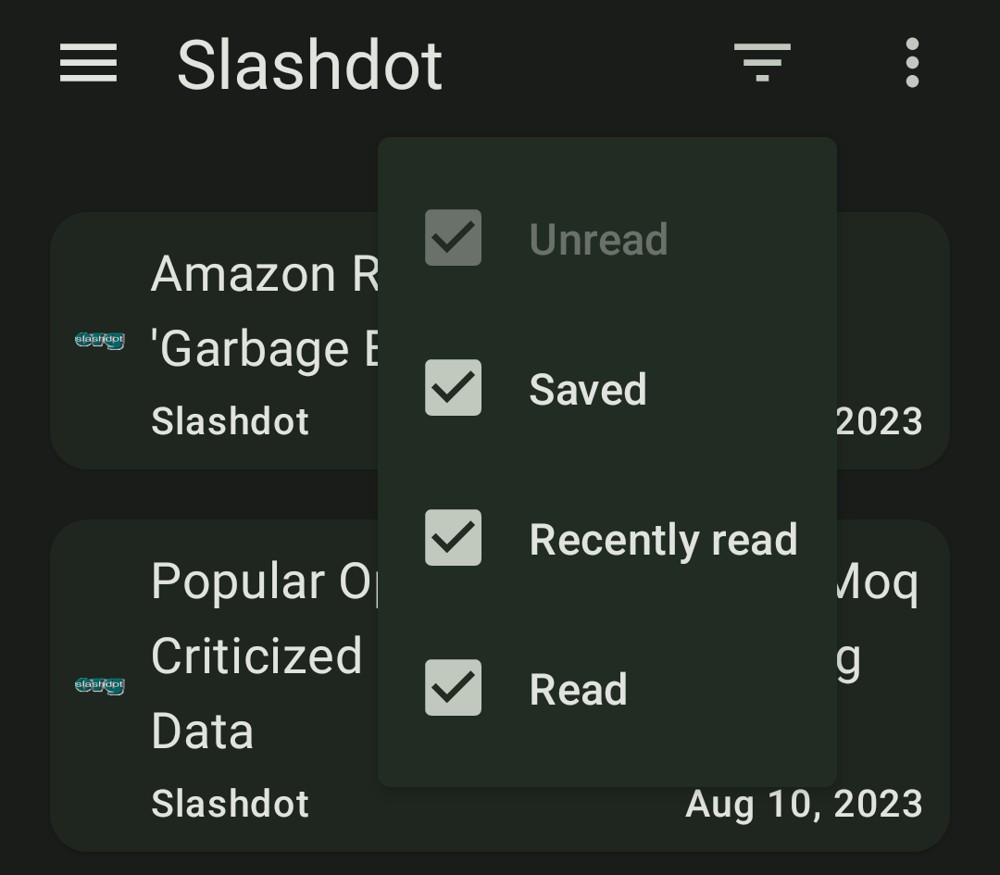
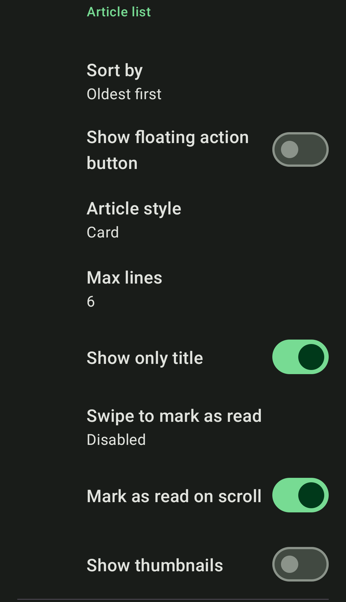

In `2.5.0`, a couple of UI changes were implemented which have caused.. let's say mix feedback.

In `2.6.0` new options are added which will make it possible to tweak Feeder to match previous behavior, should you prefer.

The toggle button for showing read/unread items is now a more clear filter menu:

And in the settings, related settings have been grouped together under the *Article list* heading.

Note the new configuration options:

* Max lines
* Show only title

