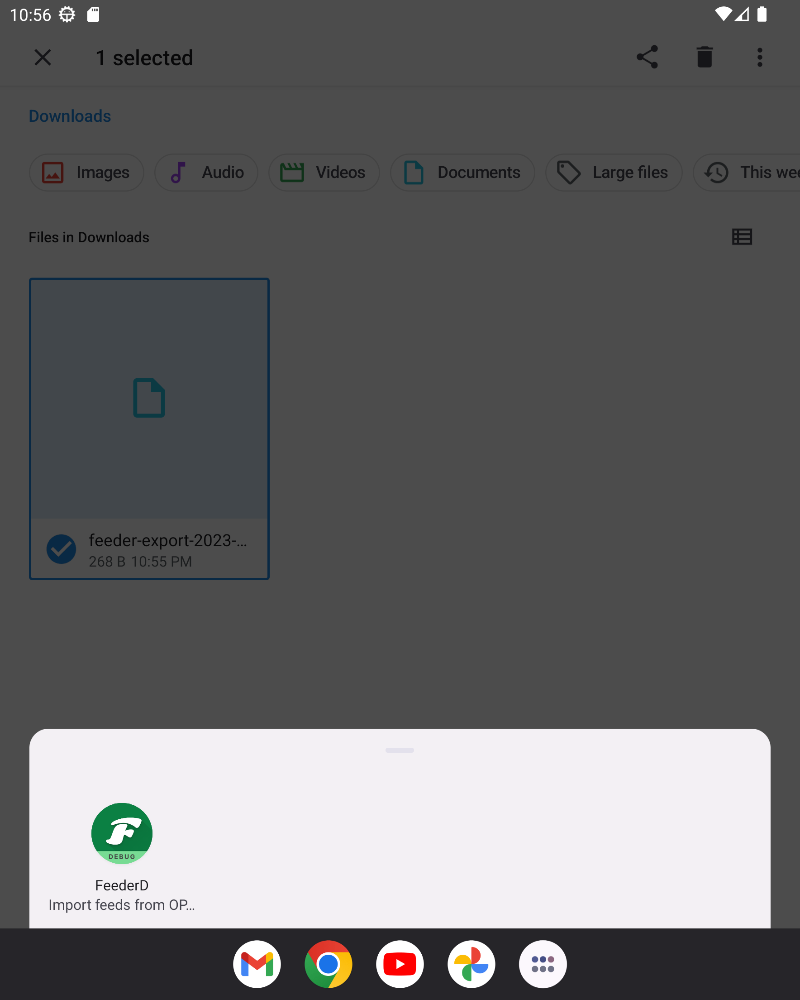
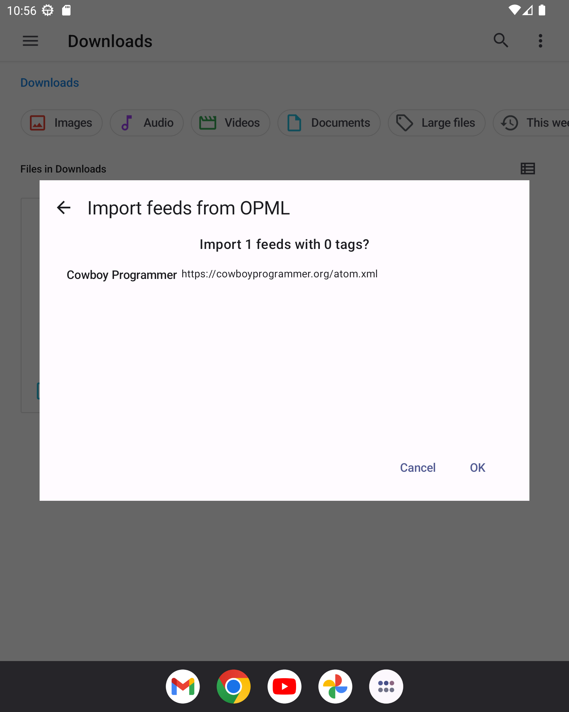
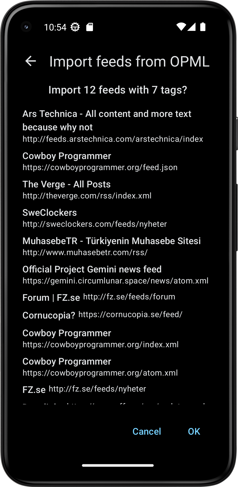

A user emailed me and asked if I could fix the filename of the OPML export from .xml to .opml.

This was a quick fix but it lead me down a rabbit hole. See screenshots.

OPML import is something many users never do (I think) and the ones that do typically only do it once or twice. Still the app should support opening the files directly in my opinion. Currently you must select "Import from OPML" in the main menu.

In next release you can click on a file directly in the file browser. This will open a new screen.

Which then leads to this little window previewing what the import will do

or like this on a phone

