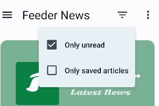

Got some feedback over the years that indicated that people were having a hard time understanding
what the eye-icon in the toolbar was for (toggling between showing read articles or not). Combined
with a need to let people view their saved articles in specific feeds/tags I decided to address both
with a new button and menu.

The menu uses the fairly standard *filter icon* (it also has a tooltip on long-press) and shows options
in plain language.

Not final yet, I'm going to be using it myself a bit first to see how I like it. But I think the overall
direction is sound. At the moment the two options are not exclusive - you control both individually which
people with many saved articles might like but not final as said.

Reach out (*send bug-report* button in the app) if you have specific opinions about this.
