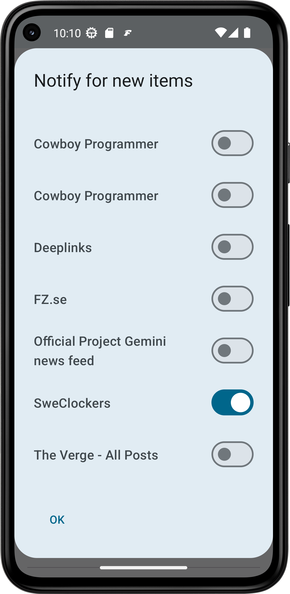

Lately I've gotten more than one email about notifications not working which turned out to be people not understanding how to enable them.

So to reduce confusion I am adding a global notification setting where you can toggle all feeds in one place - and it's also a logical place to ask for the notification permission.

In hindsight it should have been added years ago but you can't think of everything at all times.

